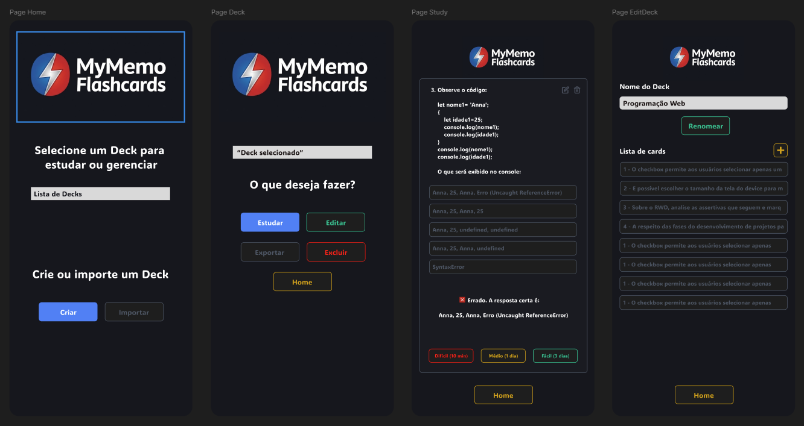

# 🗂️ MyMemo Flashcards - Projeto sendo desenvolvido em React com Typescript

Este é um projeto para o desenvolvimento de um web-app responsivo de repetição espaçada para microaprendizagem baseado em flashcards, desenvolvido com **React** e **TypeScript**, inicialmente utilizando o `localStorage` do navegador para persistência de dados.

O objetivo principal foi criar uma ferramenta personalizada para me auxiliar nos estudos das provas da faculdade, utilizando a técnica de repetição espaçada.

## 🚀 Funcionalidades

- **Gerenciamento de Decks:** Criação, edição e exclusão de baralhos (decks);
- **Integração com IA:** Importação de arquivos Word e PDF para a criação automática de decks de estudo;
- **Criação de Cards:** Adição de perguntas com suporte a múltiplas alternativas.
- **Suporte a Imagens:** Opção de anexar imagens às perguntas (armazenadas em Base64 no LocalStorage).
- **Sistema de Revisão:** Algoritmo simples de repetição espaçada com três níveis de dificuldade:
  - **Difícil:** Revisa em 10 minutos.
  - **Médio:** Revisa em 1 dia.
  - **Fácil:** Revisa em 3 dias.
- **Exclusão em Tempo Real:** Opção de excluir uma pergunta diretamente durante a sessão de estudos.
- **Persistência de Dados:** Dados salvos no `localStorage` do navegador, permitindo que o progresso não seja perdido ao fechar a aba ou reiniciar o dispositivo.
- **Exportação e Importação de Decks:** A ferramenta possibilita exportar e importar decks em formato JSON

## 🛠️ Tecnologias Utilizadas

- [React](https://reactjs.org/)
- [TypeScript](https://www.typescriptlang.org/)
- [LocalStorage API](https://developer.mozilla.org/pt-BR/docs/Web/API/Window/localStorage)

## Fase atual

- Prototipação via Figma.
- Link do protópico: https://www.figma.com/proto/eSC789nZxWp6VgVkOT4fQt/MyMemo-Flashcards?node-id=6-7&p=f&t=kP0AhmtPOHjQJxZB-1&scaling=scale-down&content-scaling=fixed&page-id=0%3A1&starting-point-node-id=4%3A81

## Algumas Telas do App

   
  

