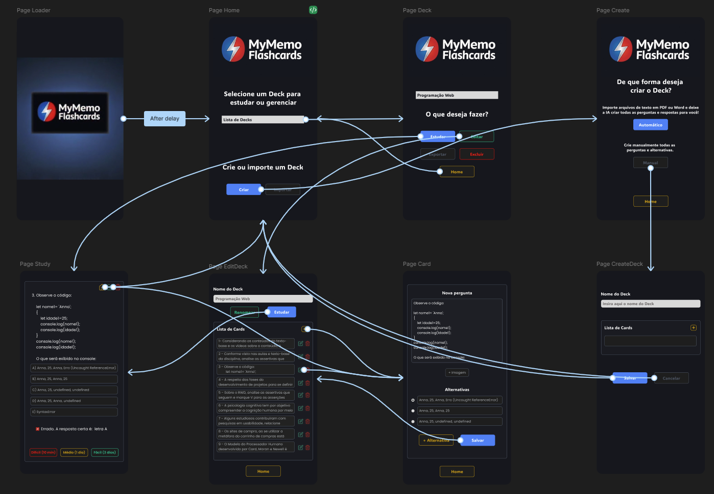

# 🗂️ MyMemo Flashcards - Projeto sendo desenvolvido em React com Typescript

Este é um projeto para o desenvolvimento de um web-app responsivo de repetição espaçada para aprendizagem baseado em flashcards, desenvolvido com `**React** e **TypeScript**`, inicialmente utilizando o `localStorage` do navegador para persistência de dados (projeto na branch main).
Após a parte de persistência e administração de dados em `localStorage`, uma alternativa mais robusta seria adicionar um backend usando `JSON file storage` mas decidi partir para algo mais profissional, então estou inserindo o `NodeJs` como backend e vou usar `SQL puro`, ou seja, sem ORM (projeto na branch feature-backend-node).
 

## 🚀 Funcionalidades

- **Gerenciamento de Decks:** Criação, edição e exclusão de baralhos (decks);
- **Integração com IA:** Importação de arquivos Word e PDF para a criação automática de decks de estudo;
- **Criação de Cards:** Adição de perguntas com suporte a múltiplas alternativas.
- **Suporte a Imagens:** Opção de anexar imagens às perguntas (armazenadas em Base64 no LocalStorage).
- **Sistema de Revisão:** Algoritmo simples de repetição espaçada com três níveis de dificuldade:
  - **Difícil:** Revisa em 10 minutos.
  - **Médio:** Revisa em 1 dia.
  - **Fácil:** Revisa em 3 dias.
- **Exclusão em Tempo Real:** Opção de excluir uma pergunta diretamente durante a sessão de estudos.
- **Persistência de Dados:** A parte de persistência de dados será realizada pelo NodeJs usando SQL puro em Postgres.
- **Exportação e Importação de Decks:** A ferramenta possibilita exportar e importar decks em formato JSON
 

## 🛠️ Tecnologias Utilizadas

- React
- TypeScript
- NodeJs
- Postgres
 

## Quer testar o app?

Seguindo a cultura de desenvolvimento ágil como SCRUM, uma versão (release) do app já foi lançada e implemetada via GitHub Actions, contendo os principais módulos da aplicação (ainda usando localStorage). Curte lá!

https://github.com/Charles-da-silva/MyMemo_ReactAndTypescript/releases/tag/v0.1.0
  

## Link e telas do protótipo no Figma

  - https://mymemoflashcards.short.gy/Figma

   
  

